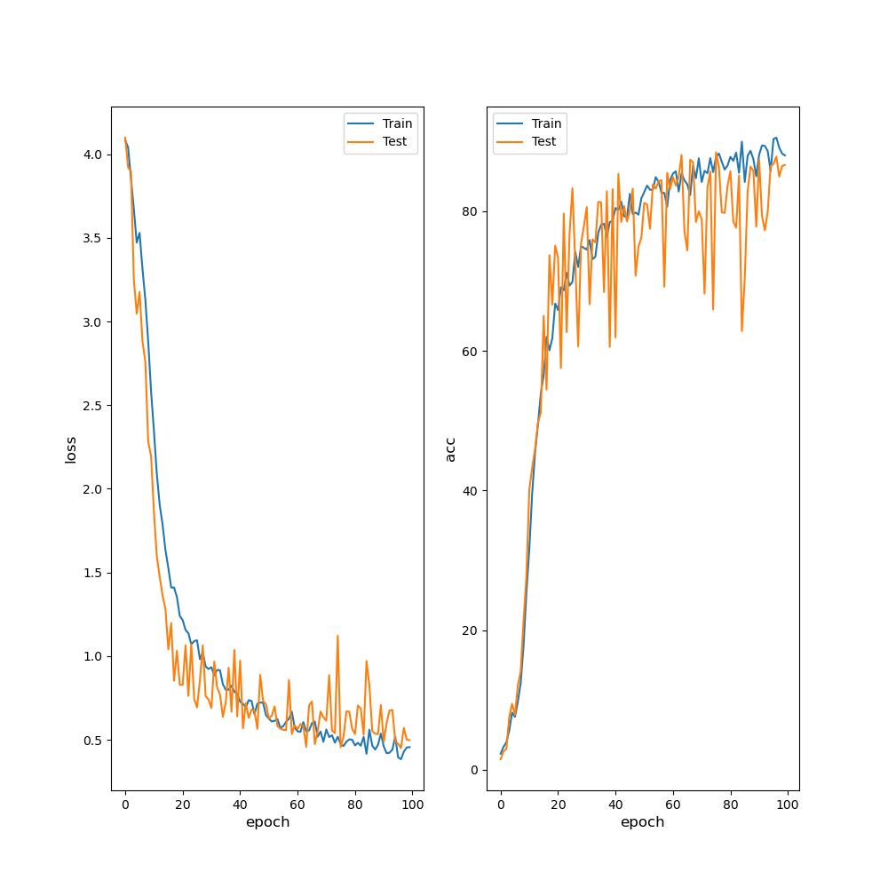

# Pitch Estimation using RNNs for Acoustic Guitar

This project aims to study the problem of estimating pitch using recurrent neural networks and the NSynth dataset. 

## Dependencies
The following is the list of libraries/infrastucture used while building and testing this architecture.

PyTorch 1.7.1
Librosa 0.8.0
Matplotlib 3.3.3
Numpy 1.19.4
Pandas 1.1.5

## Runtime environment
The following is the runtime environment used while building and testing this architecture.   
CPU: AMD 16 core running Ubuntu 18.04.5 LTS 64GB memory   
GPU: GeForce RTX 2080 Ti 11GB; Driver version: 460.27.04; CUDA version 11.2

## Steps to Train
1. Download NSynth JSON dataset from https://magenta.tensorflow.org/datasets/nsynth#files 
2. Copy the `data/nsynth<train/test/valid>/examples-subset-full-acoustic-3000.json` from this repo to the downloaded data folder (parallel to the datasets existing train/test/valid examples.json file)
3. Update the config/config.json in this repo with your local data directory.
4. Run the script `python main.py --operation=train`  

Training for 100 epoch takes around 2.5hrs on the GPU specified in the runtime environment. 

During and on completion of training, two `.pt` files will be created - 
1. Model saved by early stopping algorithm, where save occurs on reaching maximum test dataset accuracy (typically epoch 75, maximum test accuracy = 88.44% and train accuracy = 87.81%) and  
2. Model saved on completion of all epochs. Both model files and loss/accuracy plots will be saved in the /models folder.

